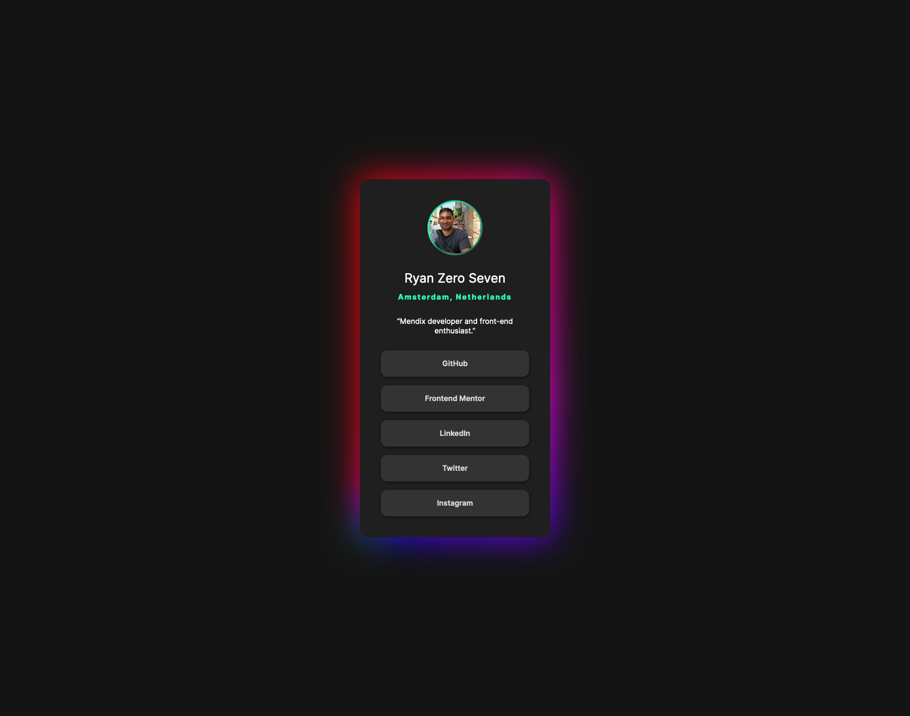

# Frontend Mentor - Social links profile solution


## Frontend Mentor - Recipe page solution

This is a solution to the [Social links profile challenge on Frontend Mentor](https://www.frontendmentor.io/challenges/social-links-profile-UG32l9m6dQ). Frontend Mentor challenges help you improve your coding skills by building realistic projects.

## Table of contents

- [Overview](#overview)
  - [The challenge](#the-challenge)
  - [Screenshot](#screenshot)
  - [Links](#links)
- [My process](#my-process)
  - [Built with](#built-with)
  - [What I learned](#what-i-learned)
  - [Continued development](#continued-development)
  - [Useful resources](#useful-resources)
- [Author](#author)
- [Acknowledgments](#acknowledgments)

## Overview

### The challenge

Users should be able to:

- See hover and focus states for all interactive elements on the page

### Screenshot



### Links

- Live Site URL: [Social link profile](https://ryanzeroseven.github.io/fem-social-links-profile/)

## My process

### Built with

- Semantic HTML5 markup
- CSS custom properties
- CSS Grid
- CSS clamp property
- CSS gradients
- CSS @keyframes animation
- Media query for reduced motion

### What I learned

I got more insight in semantic HTML, the use of keyframes and animations.

New things I worked with:

- Conic gradient
- clamp property
- keyframes

To see how you can add code snippets, see below:

```css
.proud-of-this-css {
  .glow::after {
    content: '';
    position: absolute;
    inset: 0;
    mix-blend-mode: color-burn;
    background: conic-gradient(
      red,
      magenta,
      blue,
      limegreen,
      yellow,
      darkorange,
      red
    );
    /* background-size needed to make it move. */
    background-size: 200% 200%;
    filter: blur(2rem);
    animation: moveGlow 20s alternate infinite;
    z-index: -1;
  }
}
```

### Continued development

I barely scratched the surface of keyframes, gradients and responsive properties. For the next challenge I would like to look more into:

- Gradients
- Keyframes
- Responsive units and properties

### Useful resources

- [Glow animation](https://youtu.be/VqSz7myU5iE?si=8L9SeYPqhx7GoC9c) - I got the idea and code from Kevin his video.
- [CSS Reset](https://codepen.io/kevinpowell/pen/abMdOpp) - This helped me reset my CSS.
- [HTML validator](https://validator.w3.org/nu/) - Used this to validate my HTML for accessibility.

## Author

- GitHub - [ryanzeroseven](https://github.com/ryanzeroseven)
- Frontend Mentor - [@ryanzeroseven](https://www.frontendmentor.io/profile/ryanzeroseven)

## Acknowledgments

I watch a lot of [Kevin Powell](https://www.kevinpowell.co/) youtube videos.
